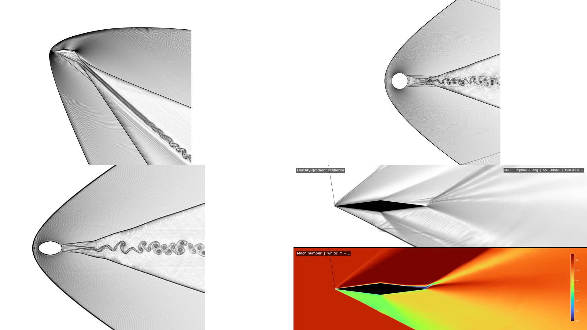

# Compressible-flow showcase movies

This package collects four 4K visualizations prepared for review and possible use on the MFC project website. The large MP4 files are distributed as assets of the companion GitHub Release; this directory keeps the provenance, render code, checksums, and submission notes version controlled.

## Movies

| Release asset | Solver | Case | Visualization | Simulated interval | Video |
|---|---|---|---|---:|---:|
| `airfoil_m3_a40_re1e4_f270_t0_t12_schlieren_framed.mp4` | MFC | diamond airfoil, M=3, alpha=40 deg, Re=10,000, grid f270 | density-gradient schlieren | t=0 to 12 | 3840x2160, 30 fps |
| `cylinder_m2p7_f180_t0_t16_schlieren_framed.mp4` | MFC | circular cylinder, M=2.7, grid f180 | density-gradient schlieren | t=0 to 16 | 3840x2160, 30 fps |
| `ellipse_m2p7_f90_t0_t16_schlieren_framed.mp4` | MFC | elliptical cylinder, M=2.7, grid f90 | density-gradient schlieren | t=0 to 16 | 3840x2160, 30 fps |
| `alpha20_m3_sst_urans_schlieren_mach_4k.mp4` | SU2 | diamond airfoil, M=3, alpha=20 deg, SST-URANS | density-gradient schlieren and Mach number, with the M=1 contour in white | t=0 to 0.000950 after restart | 3840x2160, 20 fps |

The alpha=20 deg movie is an SU2 result and is included as a supplementary comparison. It must not be presented as an MFC simulation. The first three movies are the MFC candidates.

All movies use tight framing with axes removed. The three MFC movies begin at simulation time zero. Their full files were decoded without error, and the first/join/last boundaries were reviewed visually. The SU2 movie was decoded without error and its first, middle, and last frames were reviewed at full 4K resolution.

## Reproducing the renders

- `scripts/render_mfc_initial_schlieren.py` renders the pre-continuation segments for the three MFC cases. Set `MFC_SHOWCASE_BASE` and, if needed, `MFC_AIRFOIL_SOURCE`, `MFC_CYLINDER_SOURCE`, and `MFC_ELLIPSE_SOURCE` to local copies of the corresponding run directories.
- `scripts/render_alpha20_dual.py` renders the SU2 density-gradient/Mach two-panel movie from ordered `restart_circ_*.csv` files.
- `jobs/render_alpha20.sbatch` is a portable Slurm template. Supply the appropriate account and partition at submission time.

Raw CFD snapshots are not included because they are large and remain in project storage. The rendering scripts only read raw data and write derived frames and movies.

## Website/repository submission checklist

This repository and Release provide the material normally needed to review a scientific software showcase:

- descriptive title and one-paragraph summary;
- solver, geometry, flow conditions, resolution, frame rate, and time range for each movie;
- separate identification of MFC and SU2 results;
- reproducible render scripts and representative solver configuration;
- fixed movie-wide color normalization rather than per-frame rescaling;
- SHA-256 checksums and byte sizes in `manifest.json` and `SHA256SUMS.txt`;
- a 4K preview contact sheet suitable for selecting a website thumbnail;
- repository license and citation information at the project root.

Before a website post is finalized, the MFC maintainers should choose which MFC case(s) to feature, select a thumbnail crop, and confirm the short caption and contributor credit. The Release assets can be linked directly or downloaded for YouTube upload.

## Suggested caption

High-resolution density-gradient schlieren visualizations of supersonic flow past a Mach-3 diamond airfoil and Mach-2.7 circular and elliptical cylinders, computed with MFC. The movies start at simulation time zero and use fixed movie-wide normalization. A separate SU2 Mach-3, 20-degree airfoil comparison pairs schlieren with a Mach-number contour.

## Scope and limitations

These movies are visualization outputs, not claims of experimental validation or fully converged vortex shedding. Exact numerical settings for a case should be taken from its solver input and run record. The SU2 comparison is explicitly outside the MFC result set.
